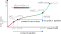
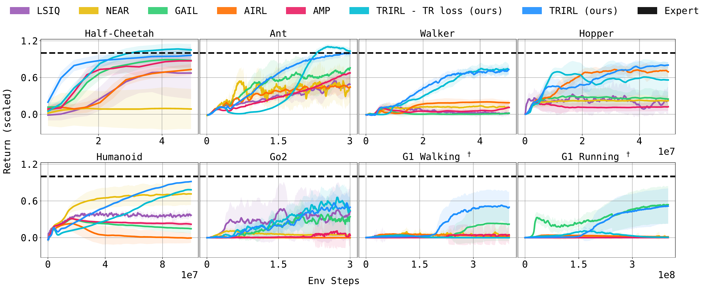

# How to Edit the TRIRL Paper Website

All visual styling lives in **`style.css`** — specifically its **Section 1 · Config** block at the top. The two HTML files (`index.html`, `blog.html`) contain only content and section-comment markers. You rarely need to touch `style.css` beyond Section 1.

---

## Table of Contents

1. [Changing colors](#1-changing-colors)
2. [Changing the font](#2-changing-the-font)
3. [Adjusting text sizes](#3-adjusting-text-sizes)
4. [Replacing the hero figure](#4-replacing-the-hero-figure)
5. [Replacing figure placeholders](#5-replacing-figure-placeholders)
6. [Editing site elements](#6-editing-site-elements)
   - [Highlight / callout block](#highlight--callout-block)
   - [Theorem block](#theorem-block)
   - [Equation block](#equation-block)
   - [Stat strip](#stat-strip)
   - [TL;DR block](#tldr-block)
   - [Buttons](#buttons)
   - [Section headings](#section-headings)
7. [Adding a new section](#7-adding-a-new-section)
8. [Filling in the blog post](#8-filling-in-the-blog-post)
9. [Updating links and metadata](#9-updating-links-and-metadata)
10. [Setting up GitHub Pages](#10-setting-up-github-pages)

---

## 1. Changing Colors

Open `style.css`. At the very top you will find the **Config block** (`Section 1`):

```css
:root {
  --c-bg      : #f5f7fd;   /* page background          */
  --c-surf    : #ffffff;   /* cards, code blocks, pre  */
  --c-surf2   : #edf2fc;   /* hero tint, theorem bg    */
  --c-accent  : #1d6fe8;   /* primary highlight colour */
  --c-text    : #18181b;   /* body text                */
  --c-head    : #0d0e14;   /* headings                 */
  --c-muted   : #556070;   /* secondary text           */
  --c-subtle  : #8a9cb0;   /* labels, placeholders     */
  --c-border  : #dce4ef;   /* borders                  */
  --c-dot     : #c4cfdf;   /* dot-grid dots in hero    */
}
```

Change any hex value and the change propagates everywhere. For example, to switch the accent to a warm red:

```css
--c-accent : #e8391d;
```

The `body.dark { ... }` block just below gives dark-mode overrides for the same tokens — edit it the same way.

---

## 2. Changing the Font

Two steps:

There are two font variables: `--font-heading` (the h1 title, currently Fraunces) and `--font-body` (everything else, currently DM Sans).

**Step 1** — in `style.css` Section 1, update one or both:

```css
--font-heading : 'Playfair Display', Georgia, serif;
--font-body    : 'Inter', system-ui, sans-serif;
```

**Step 2** — in **each HTML file** (`index.html` and `blog.html`), find the `FONT` comment in `<head>` and update the Google Fonts URL to include your chosen families:

```html
<link href="https://fonts.googleapis.com/css2?family=Playfair+Display:wght@700&family=Inter:wght@400;500;600;700&display=swap"
      rel="stylesheet">
```

Popular body font alternatives:
- `Inter:wght@400;500;600;700`
- `Plus+Jakarta+Sans:wght@400;500;600;700`
- `Outfit:wght@400;500;600;700`

Popular heading font alternatives:
- `Fraunces:opsz,wght@9..144,600;9..144,700` _(current — modern serif)_
- `Playfair+Display:wght@700` _(classic editorial serif)_
- `DM+Serif+Display` _(pairs naturally with DM Sans body)_
- Remove the heading font entirely and set `--font-heading: var(--font-body)` for a pure sans-serif look.

---

## 3. Adjusting Text Sizes

All size values are in Section 1 of `style.css`:

```css
--text-xs   : 11px;   /* tiny labels, badges            */
--text-sm   : 13px;   /* captions, metadata, footer     */
--text-base : 15px;   /* body copy                      */
--text-lg   : 16px;   /* TL;DR lead paragraph           */
--text-h1   : 25px;   /* paper title                    */
--text-h2   : 12px;   /* section labels (uppercase)     */
--text-stat : 22px;   /* stat strip numbers             */
--lh-base   : 1.72;   /* body line-height               */
```

---

## 4. Replacing the Hero Figure

In `index.html`, find the `HERO FIGURE` section comment. Currently it looks like:

```html
<div class="hero-ph ap">
  <span class="hero-ph__label">Hero Figure</span>
  <span class="hero-ph__hint">Replace this block with your paper's main figure</span>
</div>
```

Replace the **entire `<div class="hero-ph">` block** with a single image tag:

```html

```

The `.hero-img` class gives it full width, a rounded border, and the same margin as the placeholder. For SVG files the image will be crisp at any screen size.

---

## 5. Replacing Figure Placeholders

Every `<div class="fig-ph">` placeholder is inside a `<figure>` element. Replace just the `div` with an ``:

**Before:**
```html
<figure>
  <div class="fig-ph ap">[Figure: Main results]</div>
  <figcaption class="ap"><strong>Figure 2.</strong> ...</figcaption>
</figure>
```

**After:**
```html
<figure>
  
  <figcaption class="ap"><strong>Figure 2.</strong> ...</figcaption>
</figure>
```

Available figures in `static/figures/`:
| File | Content |
|---|---|
| `correction_illustration.svg` | TRIRL vs. MCE-IRL concept figure |
| `buffer_illustration_v3.svg` | Discriminator buffer illustration |
| `trirl_results.png` | Main imitation learning results |
| `TRIRL_ablations_tight.png` | Ablation study |
| `trirl_sb_combined_GRID.png` | Grid-world reward recovery |
| `kl_and_dual.png` | KL + dual objective convergence |
| `env_snapshots.jpg` | Environment snapshots |

---

## 6. Editing Site Elements

### Highlight / Callout Block

HTML pattern (left-accented blue bar):
```html
<div class="hl-block">
  Your key point or callout text here.
</div>
```

To change the bar colour, update `--c-accent` in `style.css` Section 1 (it affects all accented elements). To make a one-off colour change for a single block, add an inline style:
```html
<div class="hl-block" style="border-left-color: #e8391d;">
  This callout has a red bar.
</div>
```

---

### Theorem Block

HTML pattern (tinted background with a label):
```html
<div class="thm-block">
  <div class="thm-block__label">Theorem 1</div>
  Statement of the theorem in plain or MathJax text.
  Use $inline math$ or $$display math$$ freely inside.
</div>
```

To change the tint colour: update `--c-surf2` in Section 1.
To change the label colour: update `--c-accent`.

For a different label (Lemma, Corollary, Definition, etc.), just edit the text inside `<div class="thm-block__label">`.

---

### Equation Block

HTML pattern (centred, surfaced container):
```html
<div class="eq-block">
  $$r^{(i+1)} = r^{(i)} - \epsilon \left( \ldots \right)$$
</div>
```

The block is white-surfaced with a border. To make it borderless, add `style="border: none; background: transparent;"`.

---

### Stat Strip

The stat strip is a CSS grid. Add, remove, or reorder `<div class="stat">` blocks freely:

```html
<div class="stats">
  <div class="stat">
    <div class="stat__val">2.4×</div>
    <div class="stat__name">Short label</div>
    <div class="stat__desc">Optional description sentence.</div>
  </div>
  <!-- add more .stat blocks here -->
</div>
```

The grid automatically adjusts columns. On mobile it collapses to 2 or 1 column via the responsive rules in `style.css` Section 19.

To change the number of fixed columns on desktop, add an inline style:
```html
<div class="stats" style="grid-template-columns: repeat(3, 1fr);">
```

---

### TL;DR Block

The TL;DR is a `<p class="tldr">`. Edit its text directly in `index.html`:

```html
<p class="tldr">
  <strong>TL;DR</strong>&ensp;Your summary here.
  Use <strong>bold</strong> for key numbers.
</p>
```

The left-bar colour follows `--c-accent`.

---

### Buttons

Buttons live inside `<div class="btns">`. Add or remove `<a class="btn">` tags:

```html
<div class="btns">
  <a class="btn btn--primary" href="URL"><i class="fas fa-file-alt"></i> Paper</a>
  <a class="btn" href="URL"><i class="fab fa-github"></i> Code</a>
  <a class="btn" href="blog.html"><i class="fas fa-pen-nib"></i> Blog</a>
</div>
```

- `btn btn--primary` — filled background (use for the most important link)
- `btn` alone — outlined (for secondary links)

Icon names come from [Font Awesome 6](https://fontawesome.com/icons). Example icons: `fa-file-pdf`, `fa-database`, `fa-video`, `fa-link`.

---

### Section Headings

Main section labels (small, uppercase, with a coloured bar):
```html
<h2 class="section-label">Your Section Name</h2>
```

Sub-section labels (smaller, no bar):
```html
<h3 class="sub-label">Your Sub-section</h3>
```

Inside blog posts, use the larger heading:
```html
<h2 class="blog-h2">Section Title</h2>
```

---

## 7. Adding a New Section

Copy this template and paste it in `index.html` where you want the section:

```html
<!-- ═══════════════════════════════════════════════════════
     YOUR NEW SECTION NAME
     ═══════════════════════════════════════════════════════ -->
<h2 class="section-label ap">Your Section Name</h2>

<p class="ap">
  Your paragraph text here. Supports <strong>bold</strong>,
  <em>italic</em>, and $inline math$.
</p>

<!-- Optional: equation block -->
<div class="eq-block ap">
  $$your = equation$$
</div>

<!-- Optional: figure -->
<figure>
  <div class="fig-ph ap">[Figure placeholder text]</div>
  <figcaption class="ap">
    <strong>Figure N.</strong> Caption text.
  </figcaption>
</figure>
```

The `ap` class on each element makes it fade in on scroll. Remove it if you want elements to appear immediately.

---

## 8. Filling in the Blog Post

Open `blog.html`. Each `<div class="ph-block">` is a writing prompt placeholder. Replace it with real `<p>` tags:

**Before:**
```html
<div class="ph-block">
  <strong>Introduction — placeholder</strong>
  Write your hook here...
</div>
```

**After:**
```html
<p>Your actual introduction paragraph.</p>
<p>A second paragraph if needed.</p>
```

Update the post metadata near the top of `blog.html`:
```html
<div class="post-meta ap">
  <span><i class="fas fa-user"></i> Anish Diwan</span>
  <span><i class="fas fa-calendar"></i> July 2026</span>
  <span><i class="fas fa-clock"></i> ~8 min read</span>
</div>
```

---

## 9. Updating Links and Metadata

In `index.html`, search for these placeholders and replace them:

| Placeholder | Where | What to put |
|---|---|---|
| `[GITHUB_USERNAME]` | `<link rel="canonical">`, og/twitter tags | Your GitHub username |
| `[PORTFOLIO_URL]` | `<a class="nav-back">` | URL of your personal/portfolio site |
| `[PAPER_URL]` | First `<a class="btn">` | Link to the PDF (ICML proceedings / arXiv) |
| `[CODE_URL]` | Second `<a class="btn">` | GitHub repo link |

Also update the BibTeX entry in the `CITATION` section with the official proceedings volume and page numbers once published.

---

## 10. Setting up GitHub Pages

1. **Enable Pages** in your GitHub repo: `Settings → Pages → Source: Deploy from branch → Branch: gh-pages → / (root)`.

2. The `.nojekyll` file in the repo root tells GitHub Pages not to run Jekyll, so your plain HTML files are served as-is. Do not delete it.

3. After pushing to the `gh-pages` branch, your site will be live at:
   `https://[GITHUB_USERNAME].github.io/trust-region-irl/`

4. It may take 1–2 minutes for changes to propagate after a push.

**To preview locally** before pushing:
```bash
cd /path/to/trust-region-irl
python3 -m http.server 8080
# then open http://localhost:8080
```

---

## Quick-Reference: CSS Class Cheatsheet

| Class | Element | What it does |
|---|---|---|
| `venue-tag` | `<span>` | Small uppercase badge (ICML 2026 / Blog post) |
| `site-title` | `<h1>` | Page/post title |
| `title-accent` | `<span>` inside `<h1>` | Colours a word in the accent colour |
| `tldr` | `<p>` | Left-bar highlighted summary paragraph |
| `btns` / `btn` / `btn--primary` | `<div>` / `<a>` | Button row and individual buttons |
| `hero-ph` | `<div>` | Dot-grid hero placeholder |
| `hero-img` | `` | Real hero image (full-width, rounded) |
| `stats` / `stat` | `<div>` | Stat grid and individual stat cells |
| `section-label` | `<h2>` | Uppercase section heading with coloured bar |
| `sub-label` | `<h3>` | Smaller sub-heading, no bar |
| `eq-block` | `<div>` | Equation container |
| `thm-block` | `<div>` | Theorem/lemma box (tinted) |
| `hl-block` | `<div>` | Left-bar callout/highlight block |
| `fig-ph` | `<div>` | Dashed figure placeholder |
| `fig-img` | `` | Real figure image |
| `ph-block` | `<div>` | Blog draft placeholder (dashed) |
| `back-cta` | `<a>` | Bottom "back to paper" button on blog |
| `ap` | any | Fade-in-on-scroll animation (add to any element) |
